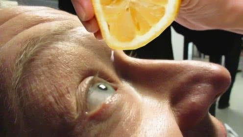

# 不作死就不会死 / No Zuo No Die.

_{docsify-updated}_

**`不作不死`**，全句为**`不作死就不会死，为什么就是不明白！`**，意为：自己没事找事，结果自己倒霉。

美国在线俚语词典“城市词典网站”收录：`no zuo no die / 不作死就不会死`。

现在，人们常说一句话：“不作不死”，这话听起来残酷，却颇有几分道理。比如，有的人脾气不好，别人说不得他，一说就跟你翻脸。

其实这样的人，并不一定坏，就是自尊心太强了。而自尊心太强的人，往往容易在生活中吃亏：别人觉得这样的人不够随和、不好接近，因此这类人往往容易错过很多好的机会。俗话说，吃一堑，长一智。

但脾气毕竟是与生俱来的，不容易改，特别是自尊心太强的人，更难听从他人建议改变自己，于是就还会吃更多、更大的亏。

怎么办呢？这个时候，或许就应该看看此书。比如《恰如其分的自尊》这本书，恰好可以让我们好好了解一下，自尊到底是什么，应该怎么做，才能既保有自尊，又不让自己在实际生活中吃亏。

此外，不恰当的自尊常常会给人的生活带来不利的、甚至是灾难性的后果。据统计，法国每年有一千名左右的青少年死亡，其中的很大一部分人是死于自杀，而我们知道，自杀的直接原因中，因为过分自尊而主动选择离世，乃是最常见的。研究表明，青少年的自杀倾向，往往跟“低自尊”，也就是对涉及个人自尊的外部行为过分敏感有关。

其实，自尊，乃是人格最根本组成部分之一，和其他与”个性“相关的特质一样，它几乎是与生俱来的，而且，跟别的性格特点相比，它还非常隐蔽，有时会令他人甚至是自己都难以捉摸。

从学理上说，`自尊`是由`自信`、`自我观`和`自爱`这三方面构成的，而`”自爱“`又是其中最关键的元素。

### 那么什么是自尊呢？

`自尊`其实就是你怎么看待自己。

我们每个人的`自尊水平`都是不一样的，有人自恋，有人自卑，还有刚好平衡。`自尊`是我们生活中的一部分，对我们的影响并不会翻天覆地，但它确渗入我们生活中的点点滴滴，直接影响我们的`幸福指数`。

自爱：

`自爱`是无条件的，无论自己表现的如何都要接纳自己，不轻易评判自己。`自爱的能力`是我们在童年时期所塑造的，童年时期如果受到足够的爱，自爱的能力就会比较强。

自信：

`自信`是我们认为自己在重要场合能够有能力采取恰当的行动。不知道什么时候自己很棒，哪些又是自己能力不足的时候，就会出现自信的不稳定现象。所以，一定要明白自己是因为什么原因做得好，做好自信与成长。

自我观：

`自我观`是我们看待自己的眼光，对自己优缺点的评估。事实上我们经常会对自己的评价飘忽不定，有很大一部分原因是对期望太高，导致我们压力很大。

### 有药可医

自尊不能解释一切现象，但可以廓清人的很多行为动机和某些行为偏差：

- 不喜欢自己的样子——总是羡慕别人的美艳脱俗、风流倜傥
- 看不起自己的出身——想不通自己的投胎技术怎么跟投球技术一样差
- 不满意自己的表现——现身在热闹的朋友圈便能让气氛瞬降冰点的本事貌似无人能及
- 不接纳自己的现状——从小到大一直有要模仿的榜样，追到吐血却忽略了自己的独一无二

于是，各种情绪病、抑郁症、酗酒、心理创伤纷纷找上门来，日子在缓缓流逝，不开心却从来不肯远离……

亲爱的，你的自尊生病了！

好在，这种病，有药可医……

相信自己、喜爱自己、信赖自己，这些方面统一构成了我们人格中最为基础的维度之一：自尊感。当一个人没有自尊心，幸福无从谈起。当一个人总是怀疑自己，很难做出好决定。相反，自尊心太强，又会经常感到受伤。好在，这一切都是可以调整的。

---

### 《恰如其分的自尊》的书评

https://book.douban.com/subject/26606002/reviews

!> [《认识自尊：世上没有幸福药，也没有自尊药》](https://book.douban.com/review/10180080/) 
让我们来想一想，你或者身边的朋友是否存在这些问题： 
很难做出决策，犹豫踌躇甚至反复拖延，今天能做的事情要拖到明天； 
在面临将自己“推销”出去的时候存在困难； 
因为担心无法成功干脆直接放弃行动； 
一直困在外界对自己的批评中无法自拔等等。 
…… 
你是否也好奇是什么原因导致了这些行为模式，又该如何解决这些问题呢？那么《恰如其分的自尊》这本书可能会给你一些全新的视角和解决方法。 
我们需要学习一些科学的方法，书的最后一章就较为详细的介绍了调整自尊的方法，如认识自己、接受失败、换位思考等，看这些小标题也许你会觉得这是老生常谈的鸡汤，但是如果你正面临着自尊等方面的问题，不妨静下心来认真思考并加以尝试，也许你会有不一样的收获。 
—— `阅是喵` 2019-05-14 

!> [《低自尊难快乐，高自尊可能招人烦，要培养孩子“恰如其分”的自尊》](https://book.douban.com/review/10281540/) 
每个孩子都会对自己的形象和能力做出评价。 
**有的孩子会认为：** 
“我总是做不到” 
“很多事儿我都不知道” 
“不是人们喜欢的人” 
“我也不喜欢我自己” 
**有的孩子会认为：** 
“我可以做很多事情” 
“我知道很多事情” 
“我是一个人们喜欢的人” 
“我喜欢我自己” 
**孩子对自己不同的认识，源于各自不同的自尊类型。** 
那什么是自尊呢？ 
在《恰如其分的自尊 》一书中，作者对自尊的定义是：我们怎么看待自己，以及是否喜欢我们眼中的自己。并将自尊分为三个部分：**`自爱`+`自信`+`自我观`** 
就自我观（自我评价）而言，如果自身的认识是积极正面的，个体的自我感觉会是良好的，行动也更高效，直面困难，解决问题。 
相反，如果自我观是负面消极的，“我不好”、“我不喜欢自己”的信念常在心中闪现，带来各种痛苦，难以感受快乐，影响生活和工作。 
可见，自尊与我们自身息息相关，认识自尊就显得尤为重要。而《恰如其分的自尊》正是一部全方位，多角度解读自尊的著作，它带领我们了解自尊的形成过程，对人多方面的影响，并通过作者多年的工作实践及总结，帮助人们找到调试和完善自尊的方法，尤为重要的是指导自己建立“恰如其分”的自尊。 
—— `圈圈` 2019-07-02 15:35:19 

!> [《恰如其分的自尊，坦然接受自己，并改正》](https://book.douban.com/review/8700252/) 
—— `ONEV` 2017-07-27 23:22:41

!> [“亲爱的，你爱我吗？”——读《恰如其分的自尊》有感](https://book.douban.com/review/9886072/) 
—— `阿玲读书` 2019-01-10 12:09:19

!> [“我不爱我自己”](https://book.douban.com/review/9855430/) 
—— `老鹰中尉` 2018-12-28 15:26:27

!> [读完这本之前的我...](https://book.douban.com/review/9441658/) 
—— `歹说歹说` 2018-06-19 16:48:01

!> [保持恰如其分的自尊](https://book.douban.com/review/7687373/) 
—— `带有果香的微风` 2015-12-11 11:20:59

!> [这本书解释了一切](https://book.douban.com/review/7683094/) 
—— `俗世宝宝` 2015-12-06 22:26:48

!> [读书笔记《恰如其分的自尊》](https://book.douban.com/review/9337616/) 
—— `善` 2018-05-01 19:29:37

!> [别让你的自尊伤害了自己](https://book.douban.com/review/9321866/) 
—— `安晨樱` 2018-04-27 16:34:05

!> [你不需要自己变得完美，你只需要自己真实](https://book.douban.com/review/8998971/) 
—— `qingerying` 2017-12-19 20:26:57

!> [自尊是可以培养的](https://book.douban.com/review/8750695/) 
—— `柚子` 2017-08-15 00:13:50
